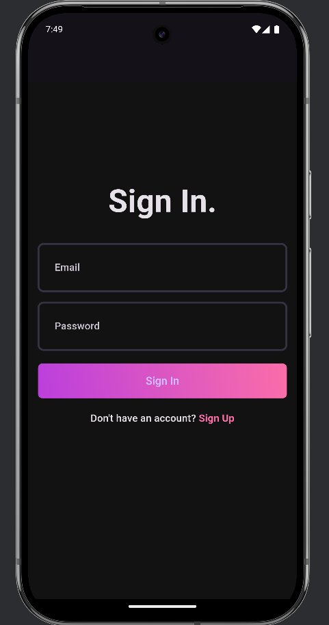
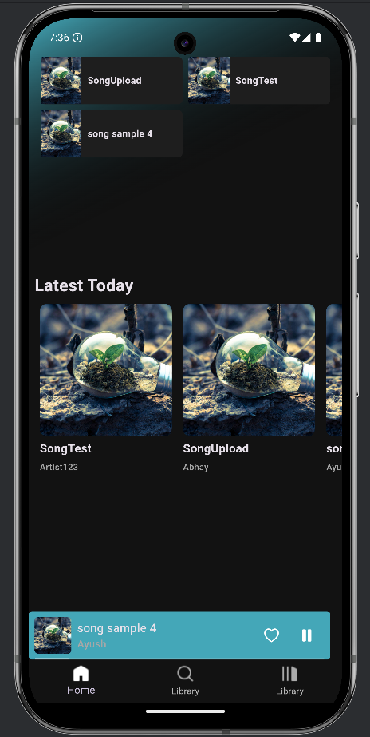
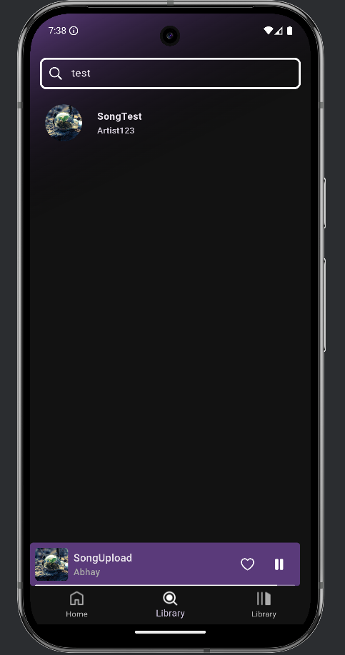
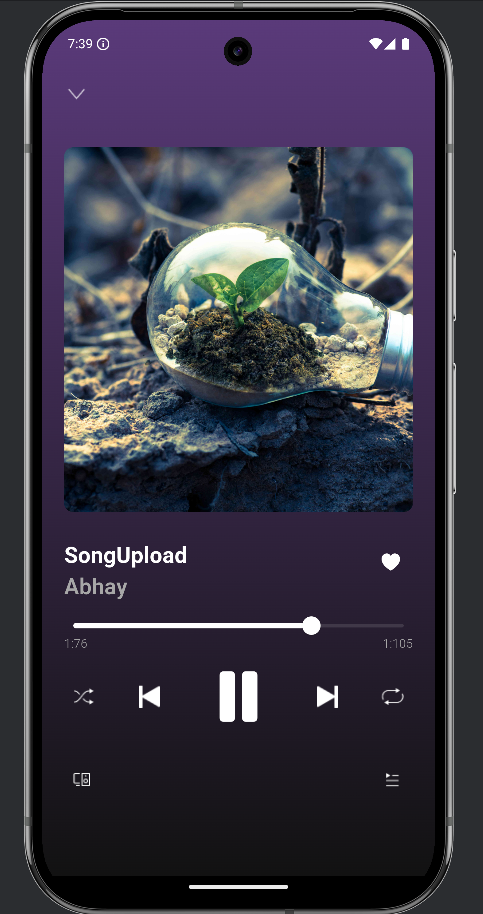
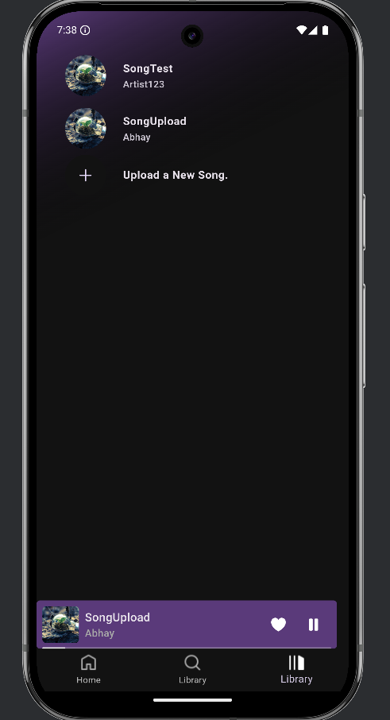

# 🎵 Musixir - Music Streaming Application

A modern, feature-rich music streaming application with a Flutter mobile client and FastAPI backend.

<div align="center">
  


</div>

## 🌟 Features

### Mobile App
- 🎨 Beautiful Dark Theme with Gradient UI
- 🔍 Smart Search with Recent Songs
- 🎵 Music Player with Background Playback
- 💫 Smooth Animations & Transitions
- 🔐 Secure Authentication Flow
- ❤️ Favorite Songs Management

### Backend Server
- ⚡ High-Performance FastAPI Server
- 🗄️ PostgreSQL Database with SQLAlchemy
- ☁️ Cloud Storage with Cloudinary
- 🔒 JWT Authentication
- 📚 Auto-generated API Documentation

## 🏗️ Architecture

```
music_app/
├──                  # Flutter Mobile Application
│   ├── lib/               # Dart source code
│   ├── assets/            # Images and resources
│   └── [More Details](README.md)
│
└── server/                # FastAPI Backend Server
    ├── routes/            # API endpoints
    ├── models/            # Database models
    └── [More Details](server/README.md)
```

## 📱 Mobile App (Flutter)

The mobile client is built with Flutter and follows modern app development practices:
- State Management with Riverpod
- Clean Architecture
- Responsive Design
- Dark Mode with Custom Theme

[➡️ See Client Documentation](https://github.com/AyushKr2003/musixir-flutter/blob/main/README.md)

## 🖥️ Backend Server (FastAPI)

The backend is powered by FastAPI and provides:
- RESTful API Endpoints
- Secure Authentication
- File Upload & Management
- Database Operations

[➡️ See Server Documentation](https://github.com/AyushKr2003/musixir-backend/blob/main/README.md)

## 🚀 Getting Started

### Prerequisites
- Flutter SDK
- Python 3.8+
- PostgreSQL
- Cloudinary Account

### Quick Start

1. Clone the repository:
```bash
git clone [repository-url]
cd music_app
```

2. Set up the backend:
```bash
cd server
python -m venv .venv
.venv\Scripts\activate  # Windows
source .venv/bin/activate  # Unix/MacOS
pip install -r requirements.txt
# Configure .env file (see server/.env.example)
uvicorn main:app --reload
```

3. Set up the mobile app:
```bash
cd ../client
flutter pub get
flutter run
```

## 📸 Screenshots

<div style="display: flex; flex-wrap: wrap; gap: 10px;">

| Splash Screen | Login Screen | Home Screen |
|--------------|--------------|-------------|
|  |  |  |

| Search Screen | Player Screen | Library Screen |
|--------------|---------------|----------------|
|  |  |  |

</div>

## 🔧 Development Setup

### Backend Configuration
Create a `.env` file in the server directory:
```env
# Database
DB_USER=postgres
DB_PASSWORD=your_password
DB_HOST=localhost
DB_PORT=5432
DB_NAME=musicapp

# Cloudinary
CLOUDINARY_CLOUD_NAME=your_cloud_name
CLOUDINARY_API_KEY=your_api_key
CLOUDINARY_API_SECRET=your_api_secret
```

### Mobile App Configuration
Update the API endpoint in `lib/core/constants/api_endpoints.dart`:
```dart
const String baseUrl = 'http://your-api-url:8000';
```

## 📝 License

This project is licensed under the [MIT License](LICENSE) - see the LICENSE file for details.

## 👥 Contributing

1. Fork the repository
2. Create your feature branch
3. Commit your changes
4. Push to the branch
5. Open a Pull Request

## 🤝 Acknowledgments

- Flutter Team
- FastAPI Team
- SQLAlchemy Team
- Cloudinary
- All Contributors

---

Made with ❤️ by Ayush Kumar Singh
